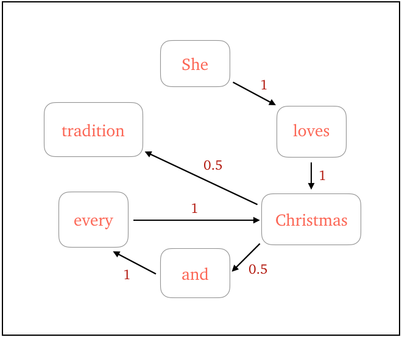
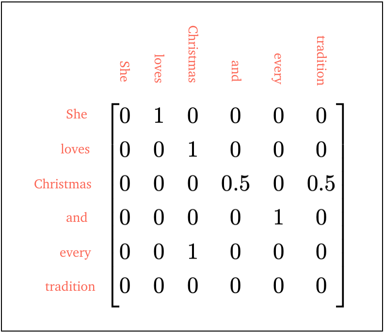
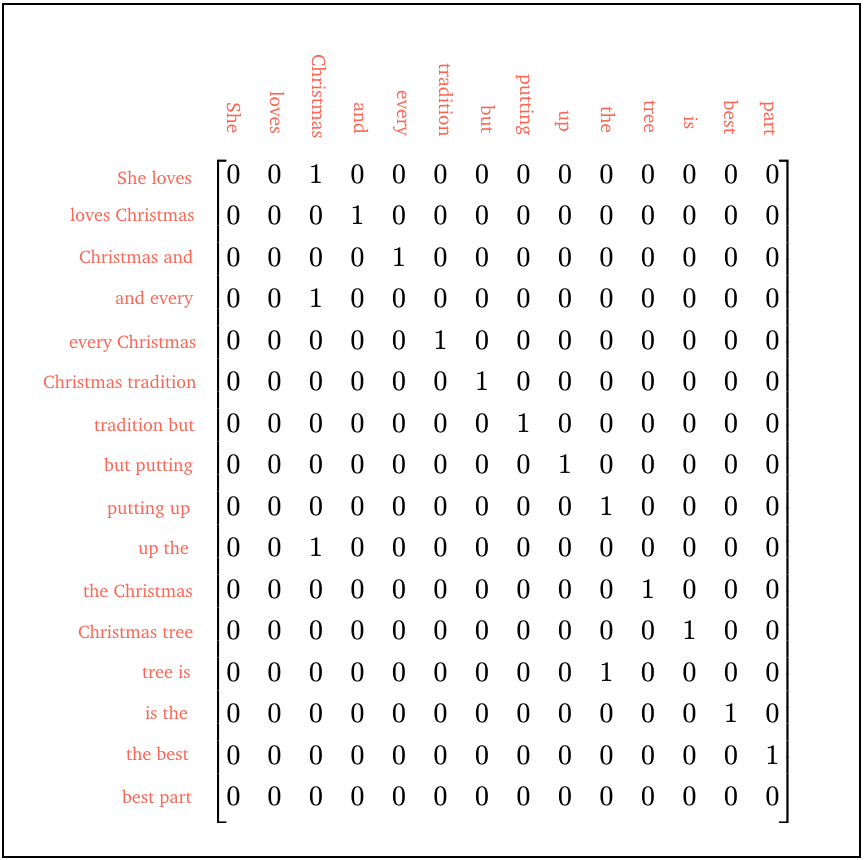
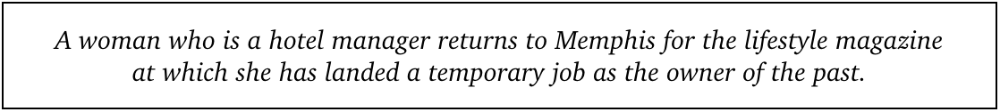
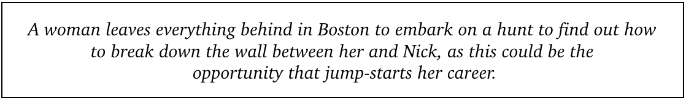
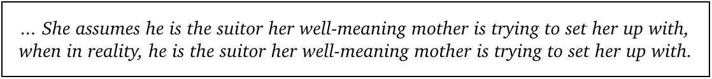

<i>Can a Markov chain write the next hit Christmas movie?</i>

Every year, generous TV networks bestow upon us many, many new tales of Christmas spirit, winter romance and adorable children. Those seasoned viewers among us may notice these movies follow a similar pattern: a woman with a great career in a big city finds herself in a small town over the holidays. Will she find love and the magic of Christmas? (The answer is always yes.)

Sometimes the plots of these movies leave you questioning whether they could maybe even be written by a computer program...so that's what I set out to investigate.

<h4>Creating fake text with Markov chains</h4>

Markov chains are a simple-yet-clever tool for generating text that sounds eerily like it could be real. We feed in some text (the <i>corpus</i>), and let our program build up rules about the order in which words appear. This just comes down to figuring out the probabilities of each word being followed by each other word in the corpus.

Then, we set off our chain by giving it a word, and let it choose the next word according to these probabilities. It then repeats this for the next word, and the next, and so on. The end result? A new block of text, generated using rules from the corpus, that might fool us into believing it's real.

<h4>How do we build a Markov chain?</h4>

 
Let's see how this works with an example sentence: <i>She loves Christmas and every Christmas tradition.</i>

In this sentence, the word <i>she</i> is always followed by the word <i>loves</i>, while the word <i>Christmas</i> is followed by both <i>and</i> and <i>tradition</i>. Let's figure this out for each unique word:

<i>she</i>: [<i>loves</i>], &nbsp;  <i>loves</i>: [<i>Christmas</i>], &nbsp;  <i>Christmas</i>: [<i>and</i>, <i>tradition</i>],   <i>and</i>: [<i>every</i>], &nbsp;  <i>every</i>: [<i>Christmas</i>]

We can make a diagram to visualise the probability of each word following another word: 

And we can even build up a matrix that represents these probabilities. This is called a <i>transition matrix</i>. The rows and columns of the matrix correspond to each unique word in the sentence:

Then, if we want to figure out the probability of the word <i>Christmas</i> being followed by the word <i>and</i>, here's what we do. We go to the row of the transition matrix corresponding to the word <i>Christmas</i> (row 3), and look at the entries in this row. The probability corresponding to the word <i>and</i> is given by the entry in column 4, which is 0.5.

So, just by looking at our transition matrix, we can see the words that follow any word, and with what probability. This is our main ingredient.

<h4>How random is random enough?</h4>

The problem with building up our chain word-by-word is that quite often, we'll end up with sentences that don't really make sense. 

 For example, let's say our corpus is now:
<i>She loves Christmas and every Christmas tradition but putting up the Christmas tree is the best part.</i>
Our Markov chain may very well output the nonsensical sentence: <i>She loves Christmas tree is the best part.</i>

A way to end up with more realistic-sounding text is by looking at blocks of <i>k</i> words, rather than just one word at a time. Let's now see which word follows each block of <i>k=2</i> words:

<i>she loves</i>: [<i>Christmas</i>], &nbsp;  
<i>loves Christmas</i>: [<i>and</i>], &nbsp;  
<i>Christmas and</i>: [<i>every</i>],   
<i>and every</i>: [<i>Christmas</i>], &nbsp;  
<i>every Christmas</i>: [<i>tradition</i>], &nbsp;  
<i>Christmas tradition</i>: [<i>but</i>],   
<i>tradition but</i>: [<i>putting</i>], &nbsp;  
<i>but putting</i>: [<i>up</i>], &nbsp;  
<i>putting up</i>: [<i>the</i>],    
<i>up the</i>: [<i>Christmas</i>], &nbsp; 
<i>the Christmas</i>: [<i>tree</i>], &nbsp;  
<i>Christmas tree</i>: [<i>is</i>],   
<i>tree is</i>: [<i>the</i>], &nbsp;  
<i>is the</i>: [<i>best</i>], &nbsp;  
<i>the best</i>: [<i>part</i>]

We then construct our transition matrix again, but now, each row corresponds to a unique block of words, and each column corresponds to a unique word:

This means our chain will never choose the word following the block <i>loves Christmas</i> to be <i>tree</i>, and our problem is solved!

Of course, this leads to another dilemma: if we don't have a large enough corpus, increasing <i>k</i> could lead to our Markov chain just re-generating our corpus, rather than giving us something new. It's best to play around with <i>k</i> to see what works best for you.

<h4>Coding our chain</h4>

When it comes down to the nitty-gritty of actually writing code to do this, there are three main steps to think about.

 
First, we want to do clean up our corpus and split it up into blocks of <i>k</i> unique words. We're going to treat every punctuation mark as a separate word, so that our program understands which words are used to start and end sentences.

 
Second, we need to build up our transition matrix and fill it with probabilities. Starting from a matrix of all zeros, we add 1 to the [<i>i, j</i>]th element of the matrix if the block of words corresponding to row <i>i</i> is followed by the word corresponding to column <i>j</i>. Once we've gone through the whole corpus and done this for every block of words, we convert the matrix elements to probabilities by dividing each element by the sum of its row. And that's how we get our transition matrix! 

 
And finally, we want to create some new text. To begin, we choose a block of words to start off our chain. This could be chosen at random, or if you want your text to start in a specific way, feed it in! Once we've given our chain some input (let's say we give it the <i>i</i>th unique block), it should look at the <i>i</i>th row of the transition matrix, and pick the next word at random from that probability distribution. We can do this by using a weighted random choice function. 

The chain then simply carries on from our new block of words, repeating the above step until it's spewed out enough new sentences to make us happy! You can see the full code, written in Python, on my <a style="color: #FA8072;" target="_blank" href="https://github.com/anu-unnikrishnan/markov-chains">Github</a>.

<h4>In goes (real) Christmas movie plots, out comes (fake) Christmas movie plots</h4>

I collected plots of a whole bunch of Christmas movies, and rewrote parts of them to help my chain out a little (for example, making sure they all started with the words 'a woman'). This way, I could kick off my Markov chain with the words 'a woman', play around with <i>k</i>, and see what ideas it had for my Christmas movie heroine. 

It came up with some pretty good storylines:

And it also generated a few fun sentences:

You can play around with it yourself <a style="color: #FA8072;" target="_blank" href="https://christmas-movie-generator.herokuapp.com">here</a>!

