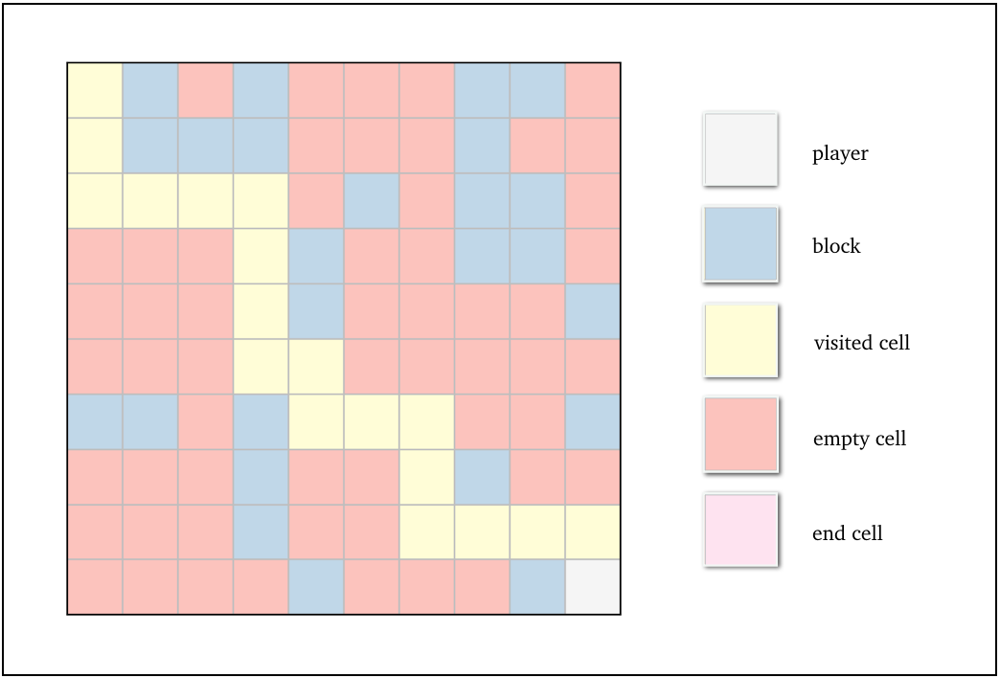
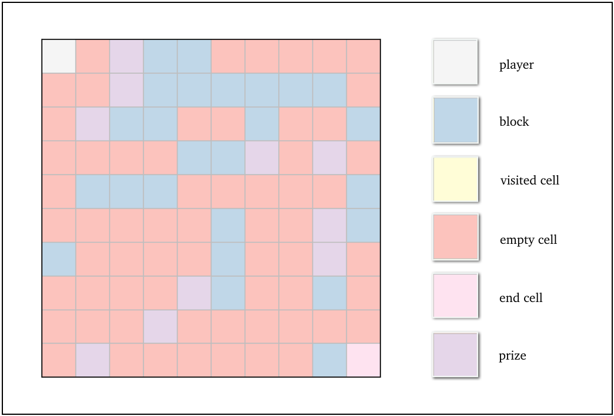

<i>Escaping from a maze using reinforcement learning.</i>

Creating a maze-solving AI is a great way to figure out how reinforcement learning works. In this type of machine learning, we train our AI by giving it rewards when it does something good, and punishing it when it does something bad. By programming it to make decisions that will maximise the reward it gets, we can build quite a clever AI! 

<h4>The rules of the maze</h4>

Let's think of our maze as a grid of cells. The player starts out in the top left corner of the grid, and it has to find the <i>end</i> of the maze in order to escape. In each time step, the player can move either upwards, downwards, left or right, to an empty cell. Some cells have <i>blocks</i>; this means the player can't pass through these. Here's an example maze:

<h4>What is Q-learning?</h4>

Q-learning is a value-based approach to reinforcement learning. Let's see what this means. We say each cell on the maze grid is a <i>state</i>, and a step in each direction is an <i>action</i>. Our AI player then transitions from one state to another using an action. 

Now, we need some way of assessing the merit of taking each action on each state, so that once we land on a cell, we can figure out the best option. For this, we use a <i>Q-table</i>, filled with <i>Q-values</i> that depend on <i>rewards</i>.

<h4>Rewarding the AI</h4>

We first need to decide how to go about rewarding the AI for its decisions. It's really up to you how big or small the rewards you give your AI are, but here's what I did:

1. Reward for going out of the maze boundaries: <i>&#8722;50</i>. 

2. Reward for crashing into a block: <i>&#8722;50</i>. 

3. Reward for visiting an already visited cell: <i>&#8722;4</i>. 

4. Reward for each move: <i>&#8722;2</i>. 

5. Reward for reaching the end of the maze: <i>+10</i>. 

 
The bottom line here is to try and make sure your AI doesn't waste time on unallowable moves (1, 2), doesn't retrace its steps too much (3), tries to take the shortest path (4), and aims to reach the end of the maze (5). You can play around with these values to see how they affect your AI's decision-making! 

<h4>Filling in the Q-table</h4>

Now, how do we calculate each Q-value? For this, we use the <i>Bellman Equation</i>:

Let's see what each of these terms mean. The expression <i>Q(st, at)</i> is the Q-value corresponding to the action <i>a</i> being taken on the state <i>s</i> at time <i>t</i>, and <i>r</i> is the reward we get for that action. We also need to find the maximum Q-value corresponding to the state in time <i>t+1</i>, denoted by <i>st+1</i>, over all possible actions <i>a</i>, which is written as max<i>a Q(st+1, a)</i>.

The parameter &alpha; is the learning rate, which tells us the importance of new versus old information. The parameter &gamma; is the discount factor, which characterises the importance of immediate versus future rewards. We can play around with the values of these parameters, and see for ourselves what effect they have on the performance of our AI. In my program, I set &alpha; = 0.1 and &gamma; = 0.9.

At the start of the program, our Q-table for an <i>n</i>x<i>n</i> maze looks like the one below. As you can see, the rows correspond to each state (each cell of the maze grid) and the columns correspond to each action. All values are initialised to zero, except for that of cell <i>[n-1][n-1]</i>, which is the end of the maze and has a maximum reward of +10.

<h4>Moving through the maze</h4>

What happens when our player moves through the maze? Here's how the Q-learning algorithm works:

1. If it's the first move, we start off by choosing a random action. If it's not, we choose the action with the highest Q-value for that state.

2. We calculate the reward the player gets for making that action.

3. We update the Q-value of that state-action pair using the Bellman Equation.

4. If that action is allowed, we do that action, and then we go back to Step 1. If that action isn't allowed, we go back to Step 1.

Then, we just have to keep repeating these steps, until the player reaches the end of the maze! 

Of course, by doing this, the player may very well end up in an endless loop, going around the maze forever. To avoid this, we should include some way of breaking out of the loop, if, for example, the total reward goes below a certain threshold.

<h4>Coding our maze solver</h4>

Let's now see how to go about coding this algorithm. Python is pretty good for this task, since it has a lot of libraries that can make our life easier.

First, we need some way of representing our maze. I used NumPy to store the maze grid as a 2D matrix, with each element as a number that indicates whether it is the position of the player, an empty cell, or a block. Displaying the maze as the colourful grid you saw previously was all thanks to Matplotlib.

Next, we have to create our Q-table. We can easily store our Q-table as a Pandas dataframe. I indexed the rows of the Q-table (representing states) as <i>[row of grid],[column of grid]</i>. Then, if we want to look up the Q-values corresponding to the maze grid cell [1][2], for example, we check out the row indexed by <i>1,2</i> of the Q-table.

Finally, let's talk about how to update the Q-values. Once we take an action on a state, we know the reward we get. We can also look up the previous Q-value for that state-action pair in our Q-table. Then, to calculate the new Q-value, all we need to do is figure out the maximum Q-value of the <i>next</i> state, i.e. the state that we end up in after taking the aforementioned action. To do this, we determine the new state, look at the corresponding row in our Q-table, and find the maximum of all the values in that row. We then just plug in all these numbers into the Bellman Equation to calculate the new Q-value! 

These are our main ingredients. To implement the maze solving algorithm, we simply use a loop to go through the steps in the previous section. 
You can see the full code on my <a style="color: #fe6d73;"  href="https://github.com/anu-unnikrishnan/mAIze-solver">Github</a>.

<h4>Training our AI</h4>

Once we have everything set up, we train the AI player by letting it have plenty of attempts at trying to escape the maze. Each attempt is called an <i>episode</i>. 

With each episode, it explores its environment more and more, and we update the values in the Q-table. This means that after a bit of training, it starts to get a pretty good idea of the best path to take to maximise the reward. And this coincides with the best way to escape! 

Below, you can see the 300th episode. The AI has found the shortest path and escaped from the maze, easy-peasy!

<h4>The exploration/exploitation tradeoff</h4>

Lastly, we're going to add something to our maze: what if we have prizes dotted around that we want the AI to collect on its way to the end? In this case, we want the player to choose a strategy that takes it through some prize cells, but at the same time, we don't want it to lose interest in escaping from the maze. An example of this type of maze is given below.

Let's give it a reward of <i>+3</i> if it collects a prize. This gives it some incentive to look for prizes. The problem with how we've designed our algorithm, though, is that once the AI has found a good path to the exit, it'll most likely keep choosing that path over and over again. This means that even if there are other paths that might lead it to more prizes, it might not end up exploring these!

The trick we'll use here is called the &epsilon;<i>-greedy</i> strategy, which lets us specify a balance between the AI choosing to explore its environment, and choosing to exploit what it already knows about its environment.

At the beginning of its training, we set &epsilon; to be high, which means the AI favours making random moves, so that it can explore its environment and figure out where the cells with prizes are. After a while, we can assume it's done enough exploration, and by setting &epsilon; to be low, we let it use the information it's collected to make the best move (i.e. the action with the highest Q-value for that state).

And here's our &epsilon;-greedy Q-learning maze-solver in action, collecting a bunch of prizes on its way out of the maze! 

