<i>Building a neural network from scratch.</i>

Neural networks can diagnose diseases, play board games better than world champions, and even tell the difference between cats and dogs.
To understand how they work their magic, let's make one! All we need is a bit of linear algebra, calculus, and NumPy.

<h4>The architecture</h4>

A neural network is made up of <i>neurons</i> in different <i>layers</i>, connected to each other. We feed the network some data through the <i>input</i> layer. It then passes through some <i>hidden</i> layers, and finally through an <i>output</i> layer, giving us an answer. 

Picking the number of layers, and the number of neurons in each layer, is something we can play around with. To start off with an easy example, let's say we want to train our network to find the XOR (exclusive-OR) of two inputs. Here's how the XOR works:

Since we have two inputs and one output, let's create a simple network that has an input layer with 2 neurons, and an output layer with 1 neuron. Let's also have a single hidden layer that has 3 neurons (but we can play around with this). We're going to number our layers starting from 0. Here's what such a network looks like:

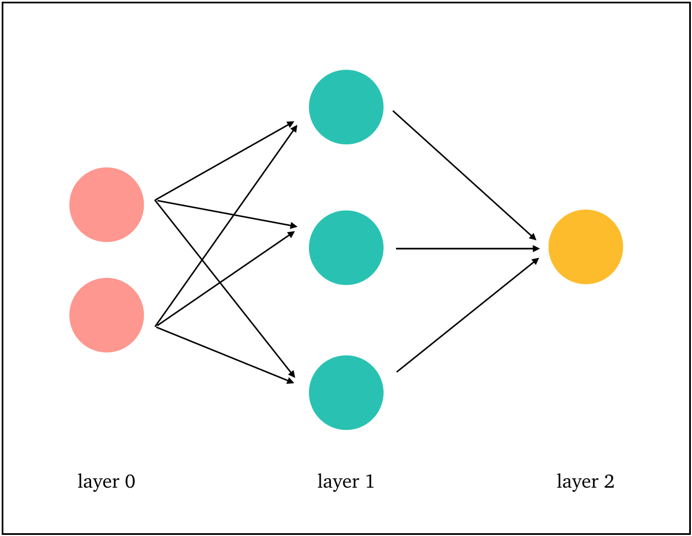

The connections between neurons in different layers have <i>weights</i>, which tell us how much the input of a neuron in one layer matters to the output of a neuron in the next layer. Each neuron also has a <i>bias</i>, which is used to adjust the output. 

Finally, we need to choose an <i>activation function</i> for each layer. This function takes the input to each neuron, which includes the corresponding weights and biases, and gives us an output that's within some desired range. We're going to use the <i>sigmoid &sigma;</i> as our activation function:

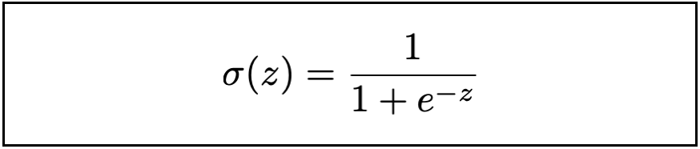

<h4>Setting up the matrices</h4>

Let's express all this in terms of matrices. First, what does our input and output data look like? We take each pair of inputs in our XOR table to be the following column vectors with their corresponding output:

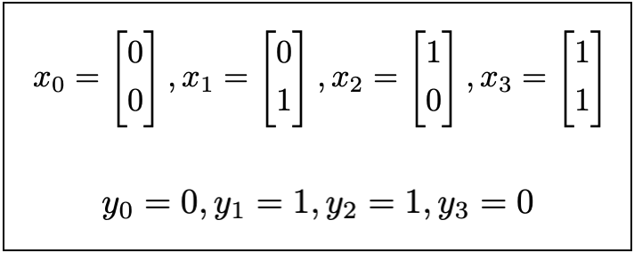

What about our weights and biases matrices? We need two weights matrices, one containing the weights of the connections between layers 0 and 1 (which we'll call <i>w0</i>), and another for layers 1 and 2 (which we'll call <i>w1</i>). 
Then, let's say the <i>[j, k]th</i> element of <i>w0</i> is the weight connecting neuron <i>k</i> in layer 0 to neuron <i>j</i> in layer 1. Similarly, the <i>[j, k]th</i> element of <i>w1</i> is the weight connecting neuron <i>k</i> in layer 1 to neuron <i>j</i> in layer 2. 

As for the biases matrices, we also need two of these (there are no biases for the input layer). The first bias matrix, which we'll call <i>b0</i>, should contain the biases of the neurons in layer 1, and the second bias matrix, which we'll call <i>b1</i>, should contain the biases of the neurons in layer 2. Then, the <i>jth</i> element of each bias matrix is the bias of the <i>jth</i> neuron in that layer.

Let's put these labels on our network picture:

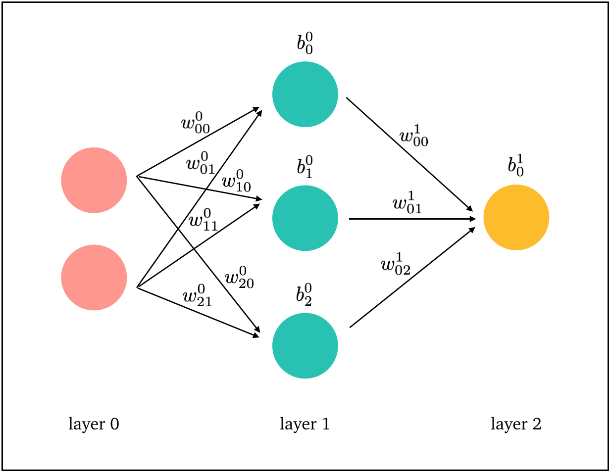

And to translate all that to matrix-speak:

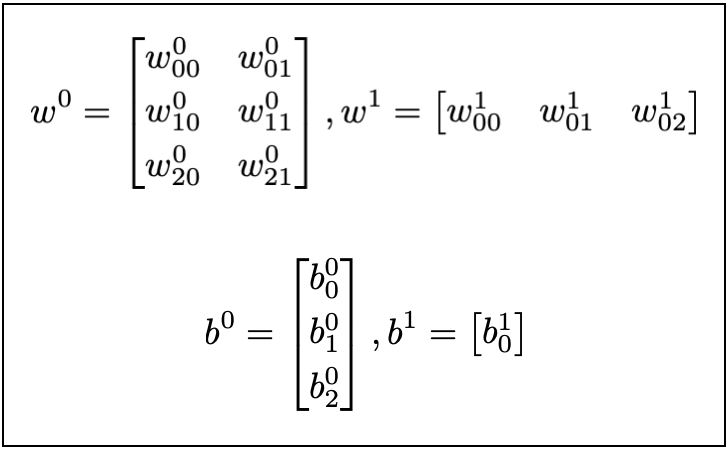

<h4>Feedforward</h4>

What happens to our input data as it goes through the layers of our neural network? This is called <i>feedforward</i>. 

Let's see what goes on between layers 0 and 1. Our input is <i>x</i>, which first needs to be weighted using <i>w0</i>, and added with the bias <i>b0</i>, to give a term we'll call <i>z1</i>. When this passes through the neurons in layer 1, it goes through the activation function <i>&sigma;</i>, giving an output that we'll denote <i>a1</i>. We can write all this as simple equations: 

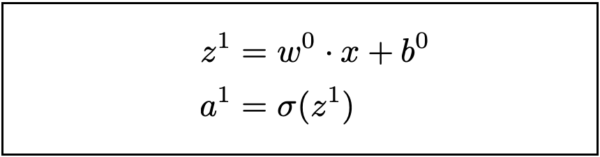

Similar things happen between layers 1 and 2! The input to layer 2 is now <i>a1</i>, which goes through weighting, biasing and activation, to give an output <i>a2</i>:

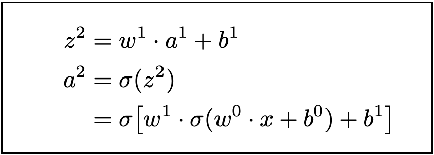

This is the output of our neural network! 

<h4>How does our network learn?</h4>

Now we've got an output, but just how bad is it? To figure this out, we use a <i>loss</i> function.  More specifically, we're going to use the <i>mean squared error</i> loss function:

The term <i>aL</i> is the activation of the output layer <i>L</i>, so in our case, <i>L = 2</i>.

Our neural network learns by adjusting the weights and biases so that it can minimise the loss function. We're going to give the network one input at a time, and let it calculate the adjustments for that input. This is called <i>stochastic gradient descent</i>. 

To do this, we'll use a method called <i>backpropagation</i>. This algorithm tells us exactly how to adjust our network parameters by going backwards through the network. We first need to determine a parameter <i>&delta;l</i> for each layer <i>l</i>, starting from the output layer <i>L</i>. 
To do this, we use the following equations:

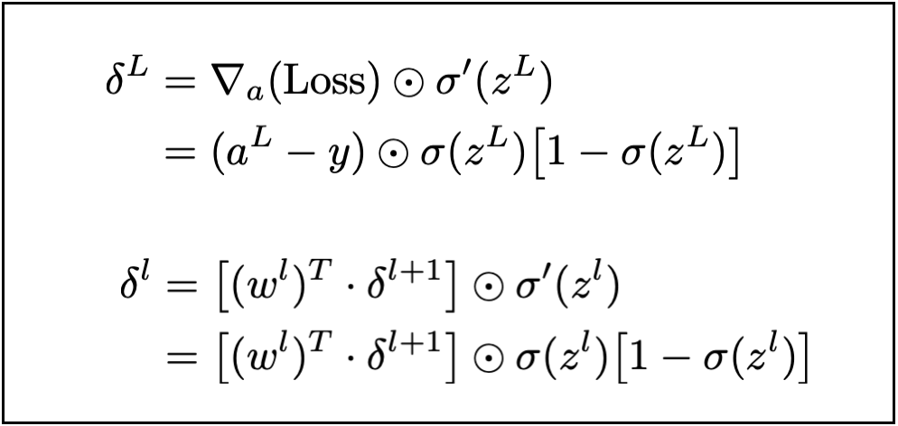

There's a few things to note here. Firstly, since we're considering each input separately, we put <i>n = 1</i> in the loss function, which means its gradient with respect to <i>a</i> is simply <i>(aL &minus; y)</i>.

Secondly, the symbol &#8857; denotes the Hadamard product, which we can calculate for two matrices of the same dimensions by taking the elementwise product. And the symbol &middot; refers to the dot product (the ordinary matrix product), which for two matrices of sizes <i>m&times;n</i> and <i>n&times;p</i> gives a new matrix of size <i>m&times;p</i>.

Finally, <i>&sigma;'</i> is the derivative of <i>&sigma;</i>, which has a particularly neat form!

Then, we use <i>&delta;l</i> to calculate the updates to each weight and bias matrix:

We update our weights and biases matrices, where <i>&eta;</i> is the learning rate (a parameter we can modify later):

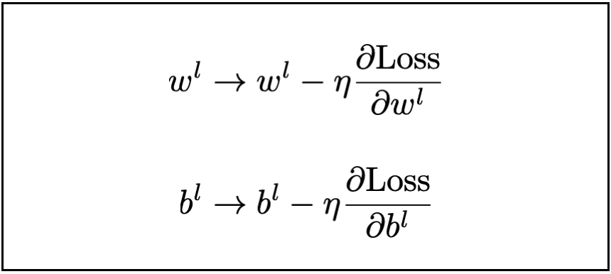

And then we do another feedforward! Each time we get to the output of our network, we calculate the loss function, and use backpropagation to figure out how much to change the weights and biases. And we keep repeating these steps for some number of <i>epochs</i>, which are full passes through the data. 

<h4>Coding our neural network</h4>

Thanks to NumPy, it's pretty straightforward to code this in Python.
Ideally, we want our code to generalise to a neural network with any number of neurons and layers.  So let's store all our parameters (weights, biases, change in weights, change in biases, <i>z</i>, <i>a</i>, <i>&delta;</i>) in arrays whose sizes depend on the number of layers. 

Then, we need two nested loops: one going through each epoch, and another going through each individual input. Once we're done with each input, we update the weights and biases. You can see the full code on my <a style="color: #fe6d73;" href="https://github.com/anu-unnikrishnan/neural-network">Github</a>.

To monitor how our neural network is doing, let's see how the loss decreases as we move through epochs and the network learns how to compute XOR:

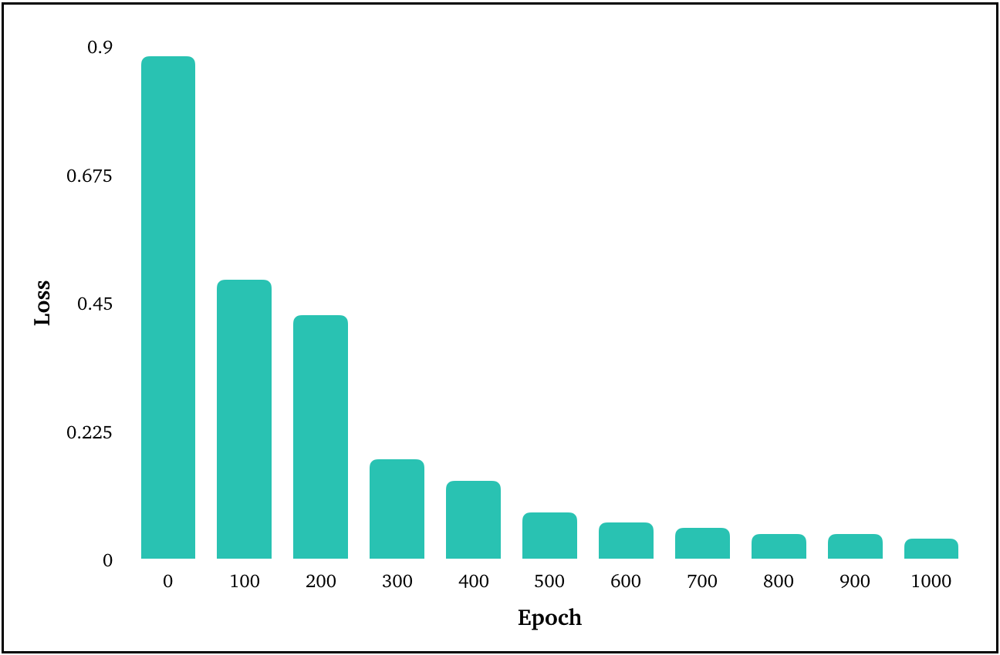

<h4>Testing it out on a dataset</h4>

Let's try out our network on an actual dataset! We're going to use the banknote authentication <a style="color: #fe6d73;" href="https://archive.ics.uci.edu/ml/datasets/banknote+authentication">data</a> from UCI. There are four columns containing image characteristics of banknotes, and a fifth column that classifies each banknote as real or fake (indicated by either 0 or 1). 

Our first step is to randomly split this data into a set for training the network, and a set for testing the network. Let's use 80% of the data for training, and the remaining 20% to test how well the training worked. We can do this easily using scikit-learn's <i>train_test_split</i> function.

 The next thing to think about is our network architecture. Since there are four features in the input data for each banknote, there should be four neurons in our input layer. And since we're just classifying the output into two possible categories (real or fake), we could just have one neuron in the output layer, and check if <i>aL</i> is closer to 0 or 1 to decide if it's real or fake. As for the hidden layer(s), feel free to play around with this.

Then, we're going to make one modification to stochastic gradient descent to make our network more efficient. Instead of updating the weights and biases after each single training input, we're going to split the training data up randomly into <i>minibatches</i> of <i>m</i> inputs. (So now we have another nested loop to do the splitting.) We'll now adjust the network parameters only after each minibatch has been processed by the network. 

We're ready to set our freshly built neural network loose on our test data! Let's see how its predictions on whether a banknote is real or fake compare to the actual answers:

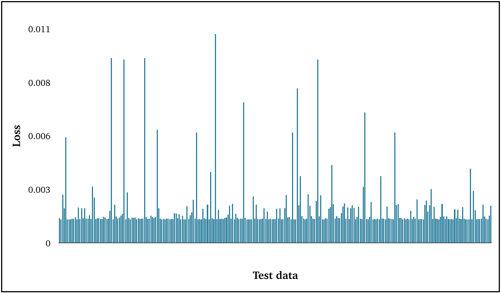

The loss stays pretty low for the set of test data, which our network has never seen before, so it's working! 

