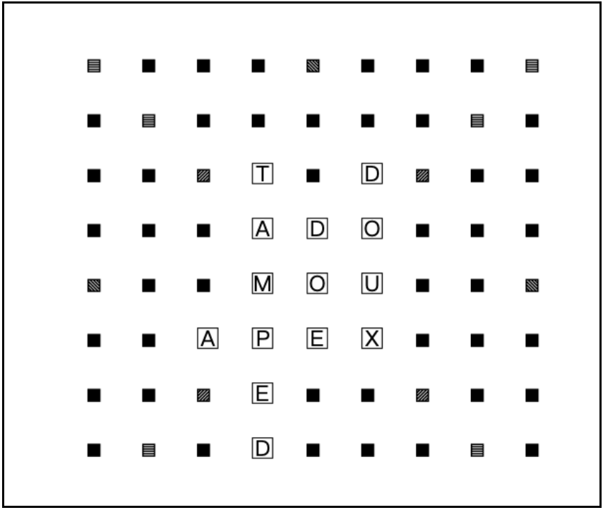
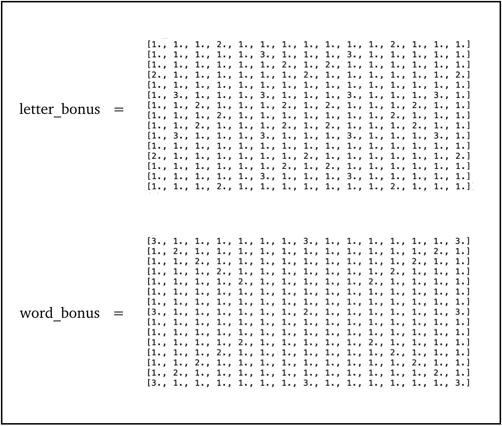
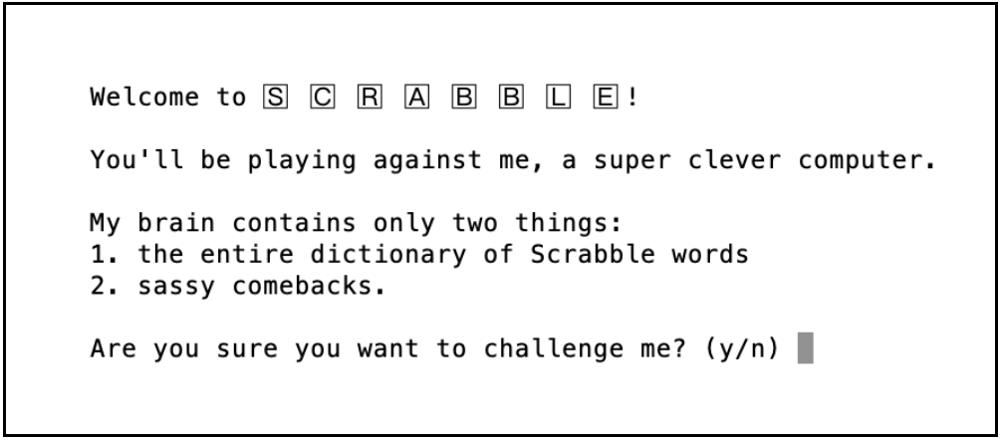
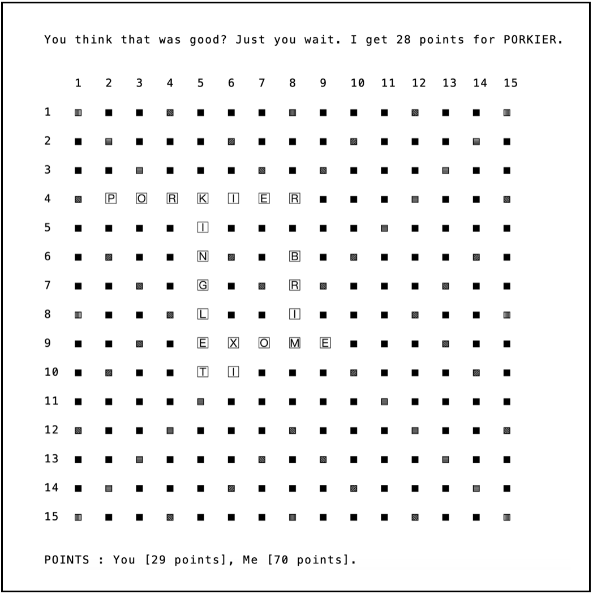
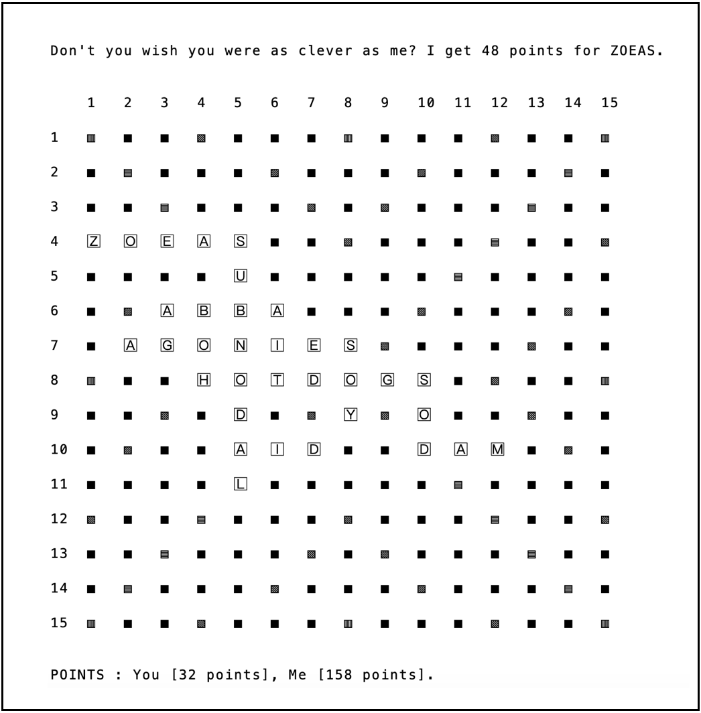

<i>Creating a crazy good Scrabble AI.</i>

With the world in lockdown over the past few months, I've been playing a whole lot of Scrabble. So much, in fact, that I decided to make a little Scrabble game for the terminal, complete with an AI opponent that's pretty hard to beat. 

<h4>The rules</h4>

The game starts off with each player getting seven random letters from a bag, and taking it in turns to make words on the Scrabble board. Each new addition to the board must give us words that make sense when read both up-to-down and left-to-right. Every time a player uses up some letters, they take new letters from the bag. 

The scoring of Scrabble is a bit more complicated. Each letter has an associated number of points (eg. X is 8 points, A is 1 point). The players get points for all the letters in each new word they make (which is often more than one word!). On top of that, some squares give you extra points: either double or triple the points for the letter on that square, or double or triple the points for each word you make using that letter. 

So, every time a player takes their turn, they calculate the points they get for the new words they've made, including any letter or word bonus points. The game ends when the letter bag is empty, and either one of the players has used up all their letters, or neither player can make any new words on the board.

<h4>Coding the game</h4>

To begin, I coded the game with two human players in Python. As a first step, we need to create our letter bag, where each letter occurs a specific number of times. Then, we assign points to our letters, which I've stored in a dictionary, and do a random sample of seven letters from the bag to give to each player.

The Scrabble board was coded as a 15x15 Numpy matrix containing string values. To keep track of where the letter and word bonuses are, we can create two more 15x15 matrices. Each element of each bonus matrix has a value 1 if there is no bonus in the corresponding square of the board, a value 2 if there is a double letter/word bonus in that square, and a value 3 for a triple letter/word bonus. After each player's turn, we should remember to update the bonus matrices to get rid of any used bonuses, by setting the corresponding elements to be 1. Below, you can see what these matrices look like at the start of the game.

Finally, we need a list of all the words that can be made on the board. For this, we can load up a file containing the Collins Scrabble words, and store the words in a Python dictionary for fast lookups.

<h4>Playing Scrabble with a human</h4>

How does the game work for two human players? Let's ask each player to enter their input as each letter followed by the square they want to play it in. For example, the input A 8 8, X 8 9, E 8 10 means play the letter A in position [8][8], the letter X in position [8][9], and the letter E in position [8][10] of the board. We process this input and check if it's valid (for example, does the player actually have these letters? Do the positions they enter correspond to empty spaces on the board?).

Then, we move on to the trickier part of checking if this actually results in valid new words on the board. To figure out which words are new, we make a list of all the words on the board at the end of each player's turn. After a player has entered the letters they wish to play, we see which new words are made by the addition of these letters to the board. We look up each word in our dictionary of allowed Scrabble words to make sure it exists. In addition, we need to check if the letters are connected: either to each other, or to a letter that's already on the board. If all these conditions are satisfied, then the player's move is valid! 

We're now ready to calculate how many points the player gets for the word. For this, we see which new letters were used to create each new word, look up how many points each letter is worth, and check if the letters cover any bonus squares.

After each player's turn, we get rid of the used letters, and replenish their stock by taking more letters from the bag at random. And of course, we have to check if the player has won and ended the game!

Finally, any player can choose to skip their turn, or to exchange any number of letters instead of playing their turn. If they choose letters to exchange, we should first check if this is a valid choice, and then draw random letters from the bag to replace these.

<h4>Playing Scrabble with an AI</h4>

How would an AI Scrabble player approach this game? I decided to give my Scrabble Bot a brain that contains all the words in the dictionary. Of course, this means it's pretty impossible to beat, but since there's an element of luck involved in the game, it can't always make incredible words. And it's also a good way of learning new words by playing against the Bot! 

Let's see how to build such a Scrabble Bot. A straightforward tactic would be to go through each row/column of the board, and make a list of the letters on that row/column, as well as the Bot's own letters. Then, we could look up all the words in the dictionary that can be made with this set of letters. 

Next, we need to go through each possible word, and figure out where to fit it in the row/column. Do we start from a letter that's already on the board? Do we start from an empty space? For every spot where the word would fit, we should check if placing the word there would result in valid words both in the up-to-down and left-to-right directions. If the answer is yes, then we calculate how many points Scrabble Bot would get for playing that word.

By looping through every row and every column of the board, and picking the highest-scoring valid word, we can determine the best possible move of our Scrabble Bot! If no words can be made, then it should exchange a random number of its (non-high-scoring) letters, or skip its turn if the letter bag is empty. 

For the full code, have a look at my <a style="color: #fe6d73;" href="https://github.com/anu-unnikrishnan/scrabble">Github</a>.

<h4>How well does this work?</h4>

Scrabble Bot is a pretty fun, albeit frustrating, opponent. Below, you can see an example game in progress, complete with taunts.

And here's a time it made some interesting words like HOTDOGS and ABBA! It generally takes no longer than 30 seconds for Scrabble Bot to decide on each move, which isn't too long to wait, especially given all the thinking it's doing.

