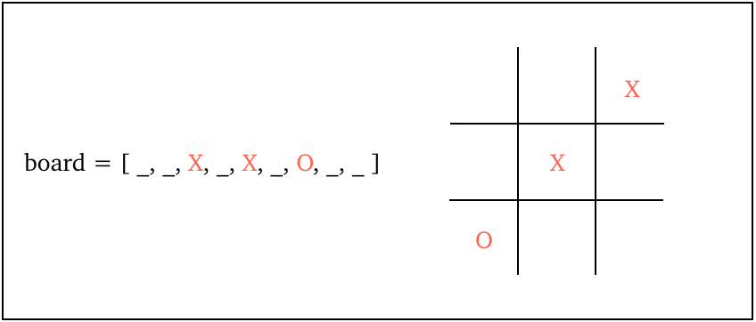
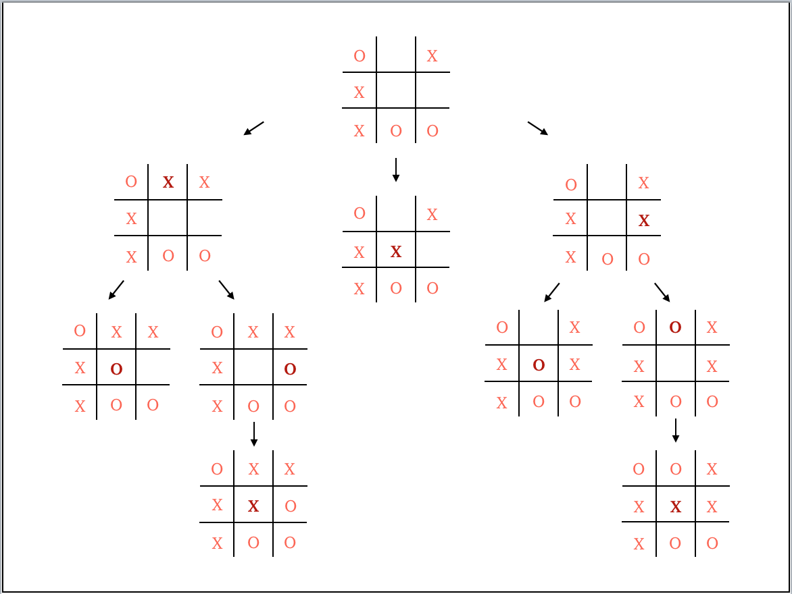
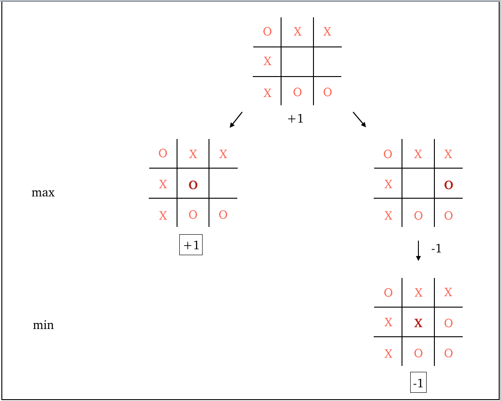
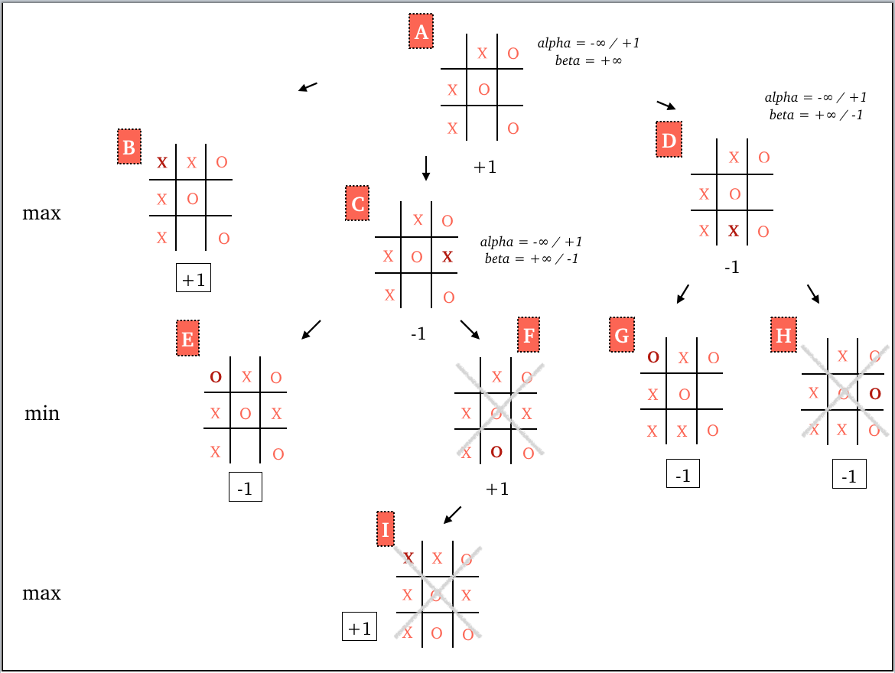

<i>How to make an AI that will never lose a game of Tic-Tac-Toe.</i>

Making an unbeatable AI may sound intimidating, so it helps to start learning the tricks through a very simple game like Tic-Tac-Toe.

<h4>The game</h4>

The rules of the game are easy: one player is X, the other player is O. They take it in turns to place X or O in any space on a 3x3 board. The winner is the first player to fill an entire row, column or diagonal with X or O.

Let's start by thinking about how to write code allowing two <i>human</i> players to play Tic-Tac-Toe. First, we need some way of representing the board. I decided to store the value of each space, which can be X, O or blank, in an array of size 9 (the number of spaces on the board). For example, the following array represents the board below:

In each round of the game, the players enter the space in which they want to place their X or O. After each move, we check if any row, column or diagonal is completely filled with either X or O. The game continues either until a player has won, or the board is full, in which case it's a draw. We can code this as a loop asking for player inputs, that we only break out of if we reach a so-called <i>terminal state</i> (X wins, O wins, or draw) of the game.

<h4>The strategy</h4>

When we humans play Tic-Tac-Toe, our strategy is quite straightforward. Before we choose a space, we usually ask ourselves two questions: <i>'If I play here, can I win?'</i> and <i>'If I play here, can my opponent win in their next turn?'</i> And we choose our move accordingly.

But a computer can do even better. It can look further beyond its opponent's next move or two. In fact, it can even look till the very end of the game, examining all the possible ways that the game could go. This is the idea behind building an AI for Tic-Tac-Toe. 

The <i>game tree</i> represents all possible states of the board starting from any point in the game until the end. Below, you can see the game tree starting from an example board state given at the top. This shows us all the possible outcomes of the game.

<h4>The Minimax algorithm</h4>

The algorithm we'll use to create our AI is called <i>Minimax</i>. Let's say player O is the computer. Then, this player is the <i>maximiser</i>, while player X is the <i>minimiser</i>. If player O wins, the <i>score</i> is +1, if player X wins, the score is -1, and if it's a draw, the score is 0. The goal of the maximiser is to maximise their score, while the minimiser minimises it. 

 
It's easiest to understand this through an example: 

Let's see how the AI makes its decision on where to place O on a board that starts out as given above. It plays in the two remaining spaces, and if the board is ever in a terminal state, it calculates the score. (The scores of terminal board states are written in the squares in the above game tree.)

As we see on the left, O has won, which means the score is +1. If a terminal state hasn't been reached, it's player X's turn. As we see on the right, there's only one space for them to play, so X wins and the score is -1.

We then propagate the scores upwards through the tree to the very topmost state. For each state, if its child states belong to the minimiser's (X) round, the score of the state is equal to the minimum of the scores of its children. On the other hand, if a state's children belong to the maximiser's (O) round, its score is equal to the maximum of the scores of its children.

In the above example, at the third (deepest) level on the right, we see it's the minimiser's (X) round, and so we send the minimum score to its parent. We don't need to do any minimisation here, however, since there's only one score (-1). 

At the second level, we have a terminal state with a score of +1 on the left, and a state with a score of -1 on the right. Since it's the maximiser's (O) round, we send the maximum of these scores (which is +1) to their parent. So, the value of the topmost state is +1.

What does this mean for our AI? Well, the AI (player O) wants to choose the best possible move, or the move that will minimise its maximum loss. So, it chooses the path that gives it the highest possible score, assuming its opponent plays optimally. This is the path we see on the left, which is how player O can get its maximum score of +1.

<h4>How efficient is Minimax?</h4>

As you might imagine, Minimax can be pretty time-consuming, even for a simple game like Tic-Tac-Toe. After all, the program would need to generate the full game tree in order to calculate the scores, and this could take ages if there are lots of empty spaces on the board. This is where <i>alpha-beta pruning</i> comes in.

Sometimes we don't need to venture down certain branches of the game tree, saving our computer a lot of time and effort. Alpha-beta pruning does exactly this, allowing us to optimise the performance of our AI.

<h4>Alpha-beta pruning</h4>

Let's denote the best choice so far for the maximiser by <i>alpha</i>, and the best choice so far for the minimiser by <i>beta</i>. Starting off with <i>alpha = &#8722&#8734, beta = +&#8734</i>, we set off exploring the game tree. If we find a higher value for <i>alpha</i> or a lower value for <i>beta</i>, we update them. If <i>alpha &#x2265 beta</i>, we don't go down that branch of the tree: it's guaranteed to not be a better option.

Here's an example to demonstrate why this works, where the computer is player X:

Starting from A, we go to B and reach a terminal state with a score of +1. Sending this score back up to A, we set <i>alpha = max(&#8722&#8734, score) = max(&#8722&#8734, +1) = +1</i>. This indicates that the best possible score so far for the maximiser is +1, corresponding to the board state B.

Then, going down to C, we first reach E and get a terminal state with score -1. Heading back up to C, we update <i>beta = min(+&#8734, -1) = -1</i>. Since we have <i>alpha &#x2265 beta</i>, we can prune the rest of the subtree (states F and I)! Going back to A, we update <i>alpha = max(+1, -1) = +1</i>, so that doesn't change. 

Finally, we go to D and down to G, reaching a terminal state with a score of -1. Going back up to D, we update <i>beta = min(+&#8734, -1) = -1</i>. Again, we get <i>alpha &#x2265 beta</i>, so we can prune the state H! We send the latest score up to A, checking if we can update <i>alpha = max(+1, -1) = +1</i>, so that remains the same. 

Looking at the diagram, it's not too hard to see why this works. Once the AI has found B, which has the maximum score possible, we just need to see if we can get this same score (since we can't get a higher score) by going down any other path in the game tree. 

After reaching E, we know that no matter what score we get from the subtree of F, it can't be lower than -1 (since this is already the lowest possible score we can get!). This means <i>min(E, F)</i> will always be -1. So, there's no need to actually explore F and below!
Similarly, going to D and down to G, we again already get the lowest possible value of <i>min(G, H) = -1</i>, so we don't need to check out H.

In this way, we can get rid of a bunch of paths even in this small game tree! As our game tree gets bigger, the time we save with this simple trick gets really noticeable.

<h4>Coding our AI</h4>

Even if we've understood the algorithms behind our AI's decision-making, it might not be obvious how to go about coding them. 

We can write our algorithm for implementing Minimax with alpha-beta pruning as a recursive function, as given below for the computer as player O:

The program keeps going deeper and deeper down the game tree until it reaches a terminal state, at which point it calculates and returns the score. By keeping track of the best score so far in each subtree, and pruning any branches that won't help, our AI can figure out the score and position of its optimal next move.

You can see the full code, written in Python, on my <a style="color: #FA8072;"  href="https://github.com/anu-unnikrishnan/tic-tac-toe">Github</a>.

<h4>Is it really unbeatable?</h4>

An unbeatable AI doesn't mean one that will always win. A game of Tic-Tac-Toe between two optimal players will always result in a draw. So don't be surprised if the seemingly perfect AI you created doesn't win every game!

